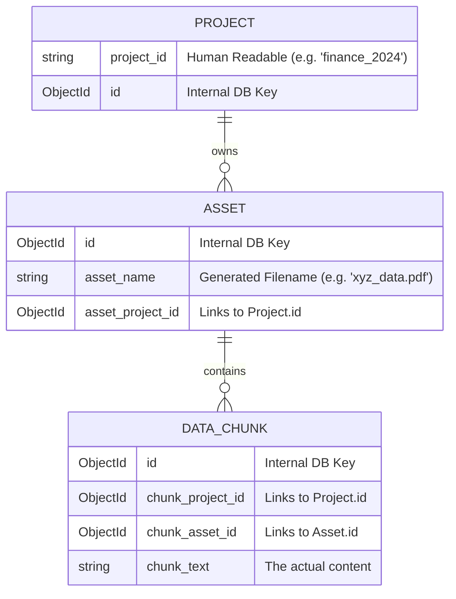

# OrionIntel Identifier Guide

This document clarifies the different types of IDs used across the project, how they relate to each other, and which ones to use in API calls.

## 1. Project Identifiers

There are two ways a project is identified:

| Name | Type | Description | Definition in Code |
| :--- | :--- | :--- | :--- |
| [**`project_id`**](file:///d:/OrionIntel/src/models/db_schemes/project.py#L9) | `String` | Use this in URLs (e.g., `/api/v1/data/upload/my_project_1`). It is a human-readable alphanumeric string you provide. | [project.py:L9](file:///d:/OrionIntel/src/models/db_schemes/project.py#L9) |
| [**`_id`** (or `id`)](file:///d:/OrionIntel/src/models/db_schemes/project.py#L8) | `ObjectId` | The internal database ID generated by MongoDB. You rarely need to use this directly in front-end requests. | [project.py:L8](file:///d:/OrionIntel/src/models/db_schemes/project.py#L8) |

---

## 2. Asset & File Identifiers

Confusion often arises here because "File" and "Asset" are used interchangeably in the code.

| Name | Type | Description | Definition in Code |
| :--- | :--- | :--- | :--- |
| [**`asset_name`**](file:///d:/OrionIntel/src/models/db_schemes/asset.py#L12) | `String` | The unique filename stored on disk (e.g., `A1B2C_report.pdf`). | [asset.py:L12](file:///d:/OrionIntel/src/models/db_schemes/asset.py#L12) |
| [**`asset_id`**](file:///d:/OrionIntel/src/models/db_schemes/asset.py#L9) | `ObjectId` | The internal database ID for the asset record. | [asset.py:L9](file:///d:/OrionIntel/src/models/db_schemes/asset.py#L9) |
| [**`file_id`**](file:///d:/OrionIntel/src/routes/schemes/data.py#L7) | `String` | **Confused Variable**: Depending on the API, this might refer to the `asset_name` string OR the `asset_id` string. | [data.py:L7](file:///d:/OrionIntel/src/routes/schemes/data.py#L7) |

### ⚠️ The "file_id" Confusion
Currently, there is a mismatch in the API that you should be aware of:
1. When you **upload** a file, the response returns the `asset_id` (the database ObjectId) as `file_id`.
2. When you **process** a file, the API currently expects the `asset_name` (the filename string) to be passed as the `file_id`.

---

## 3. Relationship Map

The following diagram shows how these IDs connect experimental data together:

---

## 4. Summary Table: What to use where?

| Goal | ID to use | Where to get it | Definition Link |
| :--- | :--- | :--- | :--- |
| **Call Upload API** | [**`project_id`**](file:///d:/OrionIntel/src/models/db_schemes/project.py#L9) | You decide this (e.g. `my_company`) | [project.py:L9](file:///d:/OrionIntel/src/models/db_schemes/project.py#L9) |
| **Call Process API** | [**`project_id`**](file:///d:/OrionIntel/src/models/db_schemes/project.py#L9) AND [**`file_id`**](file:///d:/OrionIntel/src/routes/schemes/data.py#L7) (asset_name) | `project_id` is yours; `file_id` depends on the implementation. | [data.py:L7](file:///d:/OrionIntel/src/routes/schemes/data.py#L7) |
| **Query Database** | [**`_id`**](file:///d:/OrionIntel/src/models/db_schemes/project.py#L8) | Use MongoDB's generated `ObjectId`. | [project.py:L8](file:///d:/OrionIntel/src/models/db_schemes/project.py#L8) |

> [!TIP]
> Always check if an API expects a human-readable name or a database ObjectId. In most OrionIntel routes, the URL uses human-readable IDs (`project_id`), while the JSON bodies might vary.
